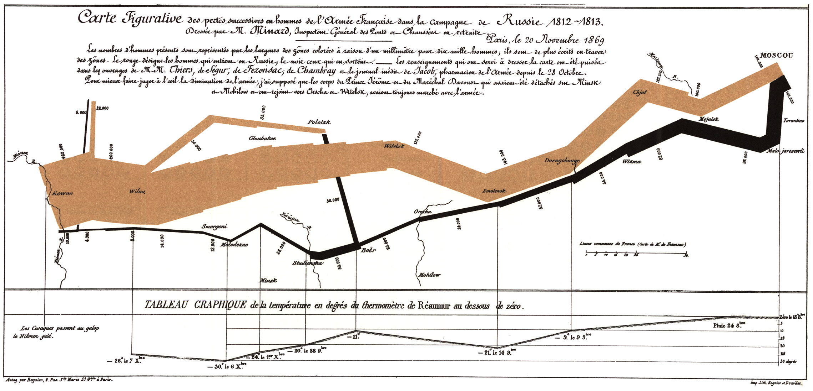

# Introduction to Probability and Statistics

## Week 9

A note on readings: in class we cover two different methods of doing inference. We often lead out with the computational approach (tests through permutation and simulation, intervals through bootstrapping) then cover the classical approximation approach (the normal distribution, the chi-squared distribution). OpenIntro has a strong emphasis on the classical methods. If you'd like more review of the computational methods, see the analogous chapters in A Modern Dive.

### Monday

- [Join class](https://zoom.us/j/190094857)
- Reading: OI p. 163 - 173
- Inference for one mean: the t-test

### Wednesday

- [Join class](https://zoom.us/j/190094857)
- Reading: OI p. 173 - 184
- Inference for two means
- PS 6 due 8 pm via gradescope

### Thursday

- [Join class](https://zoom.us/j/190094857)
- Lab TBA

### Friday

- [Join class](https://zoom.us/j/190094857)
- Reading: OI p. 184 - 195
- Inference for many means: ANOVA

* * *

## Week 10

### Monday

- [Join class](https://zoom.us/j/190094857)
- Taxonomy of Data / Taxonomy of Inference
    - [Video 1](https://zoom.us/rec/share/5fNRJJLc-V1JGYmQ1B3lBYMeIaXHT6a82iAe__tbmB5r6Sg6bBCSoziyHTWT7m7m?startTime=1586106153000)
    - [Video 2](https://zoom.us/rec/share/5fNRJJLc-V1JGYmQ1B3lBYMeIaXHT6a82iAe__tbmB5r6Sg6bBCSoziyHTWT7m7m?startTime=1586108379000)
- Exam II distributed Tuesday morning 10 am, due via gradescope Thursday at noon.

### Wednesday

- [Join class](https://zoom.us/j/190094857)
- Reading: OI p. 219 - 227
- Simple Linear Regression
    - The linear model
    - Residuals

### Thursday

- [Join class](https://zoom.us/j/190094857)
- Lab: Least Squares Regression

### Friday

- [Join class](https://zoom.us/j/190094857)
- Reading: OI p. 227 - 238
- Simple Linear Regression II
    - Estimating the line of best fit

* * *

## Week 11

### Monday

- [Join class](https://zoom.us/j/190094857)
- Reading: OI p. 238 - 243
- Simple Linear Regression III
    - Inference

### Wednesday

- [Join class](https://zoom.us/j/190094857)
- Reading: OI p. 184 - 195
- ANCOVA
- [Join Office Hours (3 - 5 pm)](https://zoom.us/j/759760558)

### Thursday

- [Join class](https://zoom.us/j/190094857)
- Lab: Inference for Regression
- [Join Evening Help (7 - 9 pm)](https://zoom.us/j/3419767082)

### Friday

- [Join class](https://zoom.us/j/190094857)
- Outliers
    - Residual
    - Leverage
    - Influence
- [Join Office Hours (3 - 5 pm)](https://zoom.us/j/759760558)

* * *

## Week 12

### Monday

- [Join class](https://zoom.us/j/190094857)
- Reading: OI p. 261 - 266
- Multiple Linear Regression I
    - Geometry
- [Join Evening Help (7 - 9 pm)](https://zoom.us/j/3419767082)

### Wednesday

- [Join class](https://zoom.us/j/190094857)
- Reading: OI p. 184 - 195
- Multiple Linear Regression II
    - Residual plots
- [Join Office Hours (3 - 5 pm)](https://zoom.us/j/759760558)

### Thursday

- [Join class](https://zoom.us/j/190094857)
- Lab: Multiple Regression
- [Join Evening Help (7 - 9 pm)](https://zoom.us/j/3419767082)

### Friday

- [Join class](https://zoom.us/j/190094857)
- Reading: OI p. 184 - 195
- Multiple Linear Regression III
    - Multicollinearity
- [Join Office Hours (3 - 5 pm)](https://zoom.us/j/759760558)

* * *

## Week 13

### Monday

- [Join class](https://zoom.us/j/190094857)
- Reading: OI p. 184 - 195
- Generalized Linear Models I
    - Logistic Regression
- [Join Evening Help (7 - 9 pm)](https://zoom.us/j/3419767082)

### Wednesday

- [Join class](https://zoom.us/j/190094857)
- Generalized Linear Models II
    - Poisson Regression
- [Join Office Hours (3 - 5 pm)](https://zoom.us/j/759760558)

### Thursday

- [Join class](https://zoom.us/j/190094857)
- Lab: Poisson Regression
- [Join Evening Help (7 - 9 pm)](https://zoom.us/j/3419767082)

### Friday

- [Join class](https://zoom.us/j/190094857)
- Bayesian Estimation
- [Join Office Hours (3 - 5 pm)](https://zoom.us/j/759760558)

* * *
* * *

## Week 8

### Monday

- Chi-squared Goodness of Fit

### Wednesday

- Class Cancelled

### Thursday

- Class Cancelled

### Friday

- Class Cancelled

* * *

## Week 7

### Monday

- Reading: OI p. 99 - 102
- Practice with the Normal Distribution
- Statistical Errors and Power

### Wednesday

- Reading: OI p. 123 - 128
- Confidence Intervals on Proportions

### Thursday

Lab: CIs on proportions

### Friday

- Reading: OI p. 128 - 134
- Quiz: Inference / `library(infer)`
- Confidence Intervals on a Difference in Proportions

* * *

## Week 6

### Monday

- Reading: OI p. 61 - 81
- Hypothesis Testing via Randomization
    - Hypotheses
    - p-values

### Wednesday

- Hypothesis Testing by other means, I
    - Simulation

### Thursday

Lab: Infer

### Friday

- Reading: OI p. 81 - 98
- Hypothesis Testing by other means, II
    - Simulation
    - Exact Probability
    - Normal Distribution

* * *

## Week 5

### Monday

- Probability V: Foundational Probability Distributions
    - Poisson
    - Normal
- No problem set this week!

### Wednesday

- Exam I

### Thursday

- Lab: Benford's Law

### Friday

- Introduction to Inference: Is Yawning Contagious?

* * *

## Week 4

### Monday

- Reading: OI p. 295 - p. 314
- Probability II
    - Conditional Probability
    - Bayes Rule

### Wednesday

- Reading:  OI  p. 315 - p. 323
- Probability III
    - Random Variables
    - Expected Value
    - Variance
- PS 3 due tonight at 8 pm

### Thursday

- Lab 3: Wrangling

### Friday

- Quiz: Probability
- Probability IV: Foundational Probability Distributions
    - Bernoulli
    - Binomial

* * *

## Week 3

### Monday

- Reading: OI 1.3
- Principles of Data Collection
- Sampling

### Wednesday

- Reading: OI 1.4
- Experimental Design
- PS 2 due tonight at 8 pm

### Thursday

- Lab 2: Sampling

### Friday

- Quiz: Principles of Data Collection
- Probability I
    - Law of Large Numbers
    - Axioms of Probability

## Week 2

### Monday

- Reading: Modern Dive 2.1-2.4
- A Grammar of Graphics

### Wednesday

- Reading: Modern Dive 2.4-2.8
- Canonical Plots
- Describing Data
- PS 1 due tonight at 8 pm

### Thursday

- Lab 1: Data Visualization

### Friday

- Reading: OI 1.6, 1.7
- Data Visualization in Practice
- Short Quiz: Data Visualization

## Week 1

### Monday

- Descriptive and Inferential Statistics
- Course Logistics
- **By Wednesday**
    - Join [Slack](https://join.slack.com/t/reed-stats-ds/shared_invite/enQtOTEwMDQyODkzNjUwLTM1MWNjZjQ5NTA5ZmMyMmQ4ZjhhYTk1Y2ZkMDE0NjRlZDBhMmE4OTg4OWJjNWUzNTFlOGIzYjE5NjA0ZmM0YzM)
        - Introduce yourself with 1 truth and 1 lie
        - Reply to a post and guess the truth
        - Send me a direct message saying hi
        - Respond to the poll

### Wednesday

No class

### Thursday Lab

Lab 0: Getting Started (due Friday 8 pm)

### Friday

- Taxonomy of Data
- Reading: OI 1.1, 1.2

- **For next time**
    - Finish and submit Lab 0