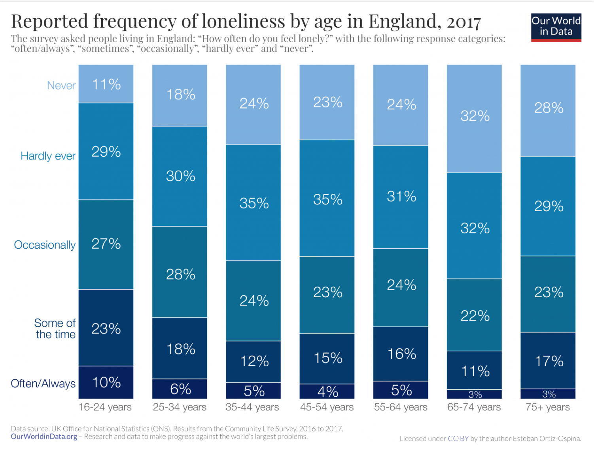
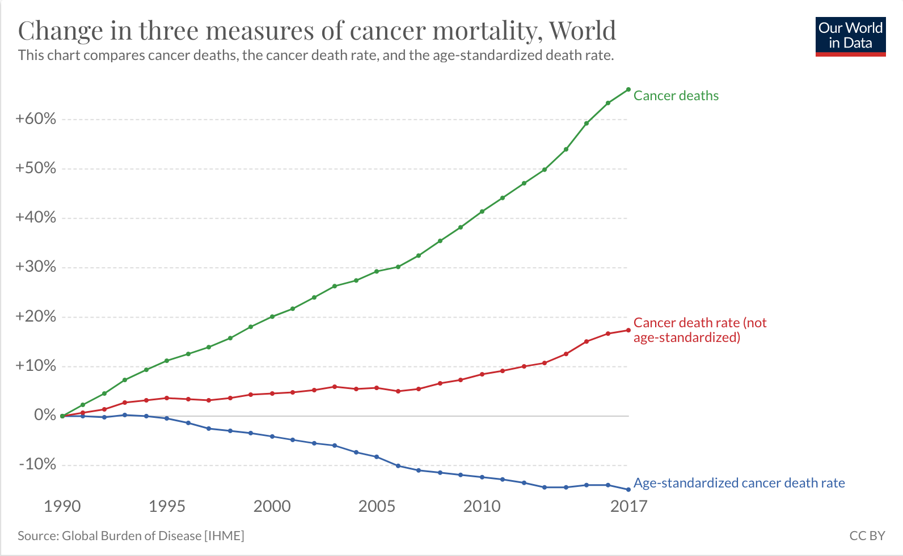
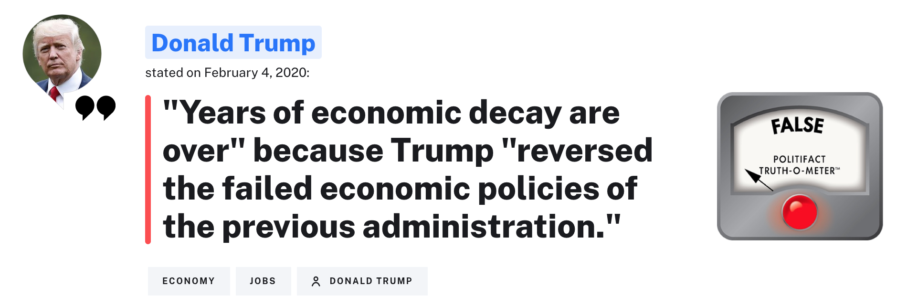
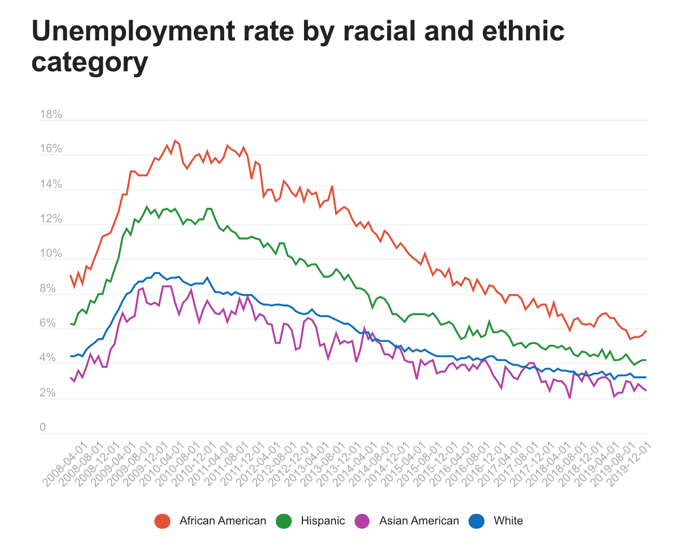
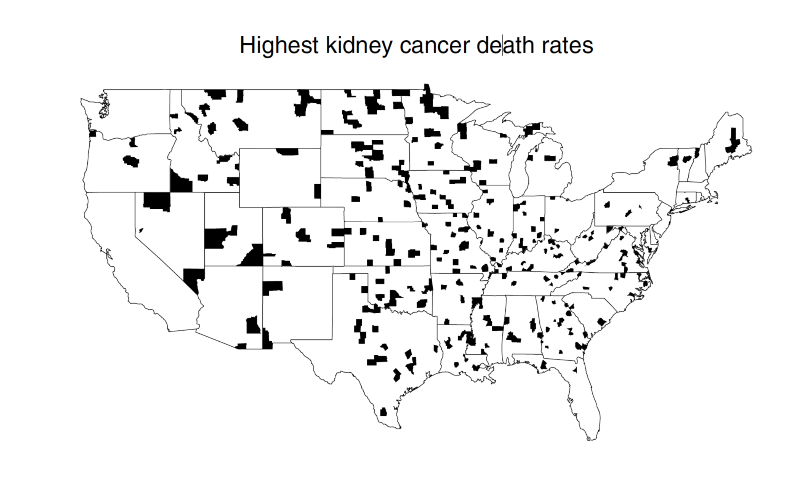
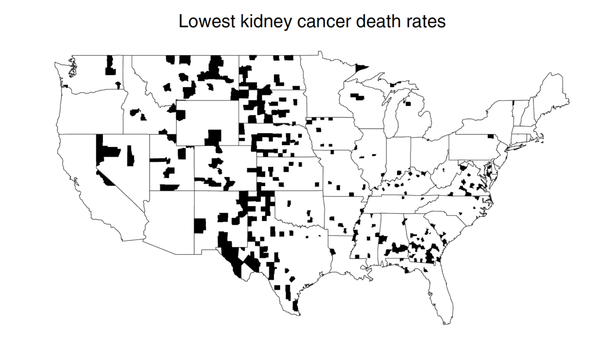

```{r setup, include=FALSE}
knitr::opts_chunk$set(message = FALSE, fig.width = 8, fig.height = 6, fig.align = "center")
```

# Fine-tuning graphics

```{r echo = FALSE}
library(tidyverse)
library(fivethirtyeight)
library(ggthemes)
data(twitter_presidents)

ggplot(twitter_presidents, aes(x = user,
                               y = retweets)) +
  geom_boxplot() +
  scale_y_log10() +
  theme_fivethirtyeight() +
  labs(x = "President", y = "Retweets (log scale)") +
  ggtitle("Obama and Trump Retweets", subtitle = "(log scale)")
```

---
# Fine-tuning graphics
--

```{r echo = FALSE}
ggplot(twitter_presidents, aes(x = retweets, fill = user)) +
  geom_histogram(col = "black") +
  facet_wrap(~user, nrow = 2) +
  scale_x_log10() +
  theme_fivethirtyeight() +
  ggtitle("Obama and Trump Retweets", subtitle = "(log scale)") +
  scale_fill_manual(values = c("blue", "red"))
```


---
# Lessons in Practical Data Viz
--

1. Compare multiple `geoms` to see which one captures best the structure you're looking to emphasize.

2. Add clear/informative axis labels (or titles).

3. Think carefully about your scales (log-transform, palettes)

4. Don't be constrained by your code - ask for help!

---
# Your turn
--

Sketch the data frame and code that would create:

--

```{r out.width=650, echo = FALSE, fig.align='center'}

```

---
# Lessons in Practical Data Viz

1. Compare multiple `geoms` to see which one captures best the structure you're looking to emphasize.

2. Add clear/informative axis labels (or titles).

3. Think carefully about your scales (log-transform, palettes).

4. Don't be constrained by your code - ask for help!

--

5. Be sure you understand - and faithfully convey - the unit of obs.

6. Use the taxonomy of data to guide your viz.

---
# Which line is the most meaningful?
--

```{r out.width=800, echo = FALSE, fig.align='center'}

```


---
# Which line is the most meaningful?

.pull-left[
```{r out.width=350, echo = FALSE, fig.align='center'}

```
]

--

.pull-right[
**Cancer Deaths**: sheer number of people that have died each year of cancer worldwide relative to the number in 1990.

**Cancer Death Rate**: number of people that die of cancer in a year divided by global population.

** Age-standardized Death Rate**: adjusts the death rate to account for changes in the age-demongraphics.
]


---
# Trump's Boom

```{r out.width=800, echo = FALSE, fig.align='center'}

```


---
# Trump's Boom

```{r out.width=800, echo = FALSE, fig.align='center'}

```

---
# Lessons in Practical Data Viz

1. Compare multiple `geoms` to see which one captures best the structure you're looking to emphasize.

2. Add clear/informative axis labels (or titles).

3. Think carefully about your scales (log-transform, palettes).

4. Don't be constrained by your code - ask for help!

5. Be sure you understand the unit of observation.

6. Use the taxonomy of data to guide your viz.

7. Context effects interpretation: normalize data, don't cherry pick

---
# What is the cause of this structure?

```{r out.width=800, echo = FALSE, fig.align='center'}

```

---
# What is the cause of this structure?

```{r out.width=800, echo = FALSE, fig.align='center'}

```

---
# Lessons in Practical Data Viz

1. Compare multiple `geoms` to see which one captures best the structure you're looking to emphasize.

2. Add clear/informative axis labels (or titles).

3. Think carefully about your scales (log-transform, palettes).

4. Don't be constrained by your code - ask for help!

5. Be sure you understand the unit of observation.

6. Use the taxonomy of data to guide your viz.

7. Context effects interpretation: normalize data, don't cherry pick.

8. Be sure the structure in your visualization is the structure you want to convey.

---
# Proportion of boys born in the US

--

```{r fig.height = 5, echo = FALSE}
library(oilabs)
data(present)
present %>%
  mutate(prop_boys = boys / (boys + girls)) %>%
  ggplot(aes(x = year, y = prop_boys)) +
  geom_line() +
  labs(y = "Proportion of boys") +
  theme_bw()
```

--

**Story**: The proportion of boys has been dropping over the last 60 years.

---
# Proportion of boys born in the US

```{r fig.height = 5, echo = FALSE}
library(oilabs)
data(present)
present %>%
  mutate(prop_boys = boys / (boys + girls)) %>%
  ggplot(aes(x = year, y = prop_boys)) +
  geom_line() +
  labs(y = "Proportion of boys") +
  theme_bw() +
  ylim(0, 1)
```

--

**Story**: There have consistently been more boys born in the US than girls.

