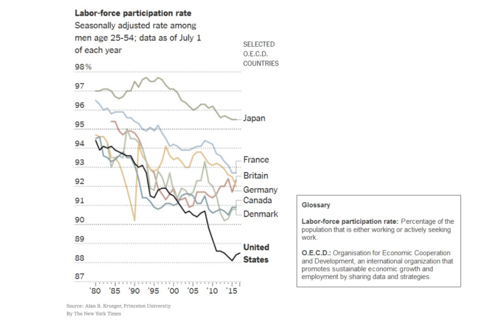

```{r, echo=FALSE, message=FALSE, warning=FALSE}
knitr::opts_chunk$set(message = FALSE, fig.align = "center", fig.height = 5)
```


# Geometric objects

--

- Points
- Bars
- Lines
- Histograms
- Boxplots
- Etc

---
# Geoms

- `geom_point()`
- `geom_bar()`
- `geom_line()`
- `geom_histogram()`
- `geom_boxplot()`


---
# Aesthetic Attributes

--

Different `aes` available depending on geometry. For points:

- x
- y
- alpha
- colour
- fill
- group
- shape
- size
- stroke

---
# Example: Gapminder
--

```{r gap, message = FALSE, eval = FALSE}
library(tidyverse) # Load ggplot2, dplyr, etc
library(gapminder) # Load gapminder data
gapminder
```

--

```{r ref.label = "gap", message = FALSE, echo = FALSE}
library(tidyverse) # Load ggplot2, dplyr, etc
library(gapminder) # Load gapminder data
gapminder
```

---
# A simple plot
--

```{r plain, eval = FALSE}
ggplot(gapminder)
```

--

```{r ref.label = "plain", echo = FALSE}
ggplot(gapminder)
```


---
# Adding a `geom` layer
--

```{r eval = FALSE}
ggplot(gapminder) +
  geom_point()
```

(in RStudio)

---
# Adding a `geom` layer, again
--

```{r geom, eval = FALSE}
ggplot(gapminder) +
  geom_point(aes(x = gdpPercap, y = lifeExp))
```

--

```{r ref.label = "geom", echo = FALSE}
ggplot(gapminder) +
  geom_point(aes(x = gdpPercap, y = lifeExp))
```

---
# Transparency
--

The points seem to be overplotting. This can be fixed by making them transparent with `alpha`, a number between 0 and 1.

```{r alpha, eval = FALSE}
ggplot(gapminder) +
  geom_point(aes(x = gdpPercap, y = lifeExp), alpha = .5)
```

--

```{r ref.label = "alpha", echo = FALSE}
ggplot(gapminder) +
  geom_point(aes(x = gdpPercap, y = lifeExp), alpha = .5)
```

---
# What if...
--

```{r alpha2, eval = FALSE}
ggplot(gapminder) +
  geom_point(aes(x = gdpPercap, y = lifeExp, alpha = pop))
```

--

```{r ref.label = "alpha2", echo = FALSE}
ggplot(gapminder) +
  geom_point(aes(x = gdpPercap, y = lifeExp, alpha = pop))
```


---
# Blue points
--

```{r color, eval = FALSE}
ggplot(gapminder) +
  geom_point(aes(x = gdpPercap, y = lifeExp, 
                 alpha = pop, colour = "blue"))
```

--

```{r ref.label = "color", echo = FALSE}
ggplot(gapminder) +
  geom_point(aes(x = gdpPercap, y = lifeExp, 
                 alpha = .5, colour = "blue"))
```

---
# Blue points, again

```{r color2, eval = FALSE}
ggplot(gapminder) +
  geom_point(aes(x = gdpPercap, y = lifeExp, 
                 alpha = pop), colour = "blue")
```

--

```{r ref.label = "color2", echo = FALSE}
ggplot(gapminder) +
  geom_point(aes(x = gdpPercap, y = lifeExp, 
                 alpha = pop), colour = "blue")
```

---
# A subtlety to be aware of
--

There is a difference between **setting** and **mapping** aesthetics.

- Mapping dynamically links data to aesthetics through `aes()`.
- Setting a parameter to a fixed value is done *outside* of `aes`.


---
# R colors
--

```{r}
colors()
```


---
# Your turn
--

Write out the `ggplot` code to produce the following plot:

```{r echo = FALSE}
ggplot(gapminder) +
  geom_point(aes(x = gdpPercap, y = lifeExp, 
                 colour = continent, size = pop),
             alpha = .5)
```

---

```{r}
ggplot(gapminder) +
  geom_point(aes(x = gdpPercap, y = lifeExp, 
                 colour = continent, size = pop),
             alpha = .5)
```

---
# Your turn
--

Write out the `ggplot` code to produce the following plot:

```{r}
ggplot(gapminder) +
  geom_line(aes(x = gdpPercap, y = lifeExp, 
                colour = continent, size = pop,
                group = country),
            alpha = .5)
```

---

```{r}
ggplot(gapminder) +
  geom_line(aes(x = gdpPercap, y = lifeExp, 
                colour = continent, size = pop,
                group = country),
            alpha = .5)
```

---
# In the news
--

Sketch this plot, write the ggplot2 code that produced it, and sketch the data set from which it must have originated.

--

```{r out.width=600, echo = FALSE, fig.align='center'}

```

---
# Extra

- facets