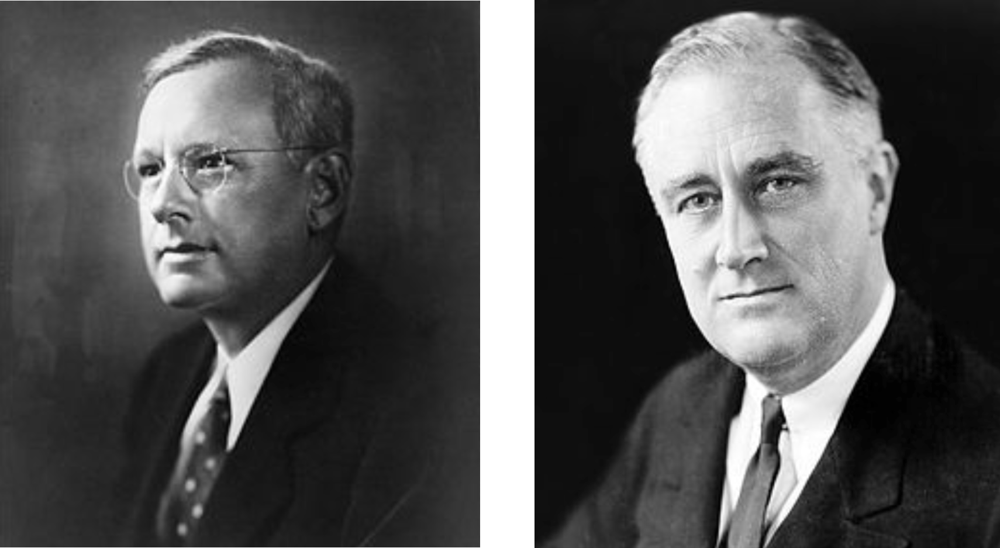

```{r setup, include = FALSE}
knitr::opts_chunk$set(fig.width = 13, 
                      message = FALSE, 
                      warning = FALSE)
```

# Match the definition with correct term

The target group about which you'd like to make inferences

<ol type="A">
  <li>Sample</li>
  <li>Population</li>
  <li>Summary statistic</li>
  <li>Anecdote</li>
</ol>

---

# Match the definition with correct term

The individual unit on which you make observations

<ol type="A">
  <li>Parameter</li>
  <li>Sample</li>
  <li>Case</li>
  <li>Census</li>
</ol>

---

# Principles of Data Collection for Inference

--

**case/observational unit** - the individual unit on which you make observations (a row in a data frame) (In `survey141` data set, a case is a single student)

--

**population** - the target group of observational units about which you'd like to make inferences (size of the population: $N$)

--

**sample** - a subset of the population on which you have data (size of the sample: $n$)

--

**anecdote** - very small sample of data collected haphazardly (usually $n = 1$)

--

**census** - sample = population (complex, expensive, and sometimes impossible to achieve)

---

# Sampling considerations

You're a senior Psychology major conducting a study that examines procrastination among Reed students.  How should you select a sample?

--

**A.** Post a link to your survey on your Facebook page.

$$n \approx 100$$

--

**B.** Get a list of Reed student emails from the Registrar, take a simple random sample (SRS), and email that sample.

Initial $n = 100$, Final $n = 34$

---

```{r out.width=800, echo = FALSE, fig.align='center'}

```

---

# Landon v. FDR, 1936

Literary Digest polled 10 million Americans, 2.4 million responded.

N = 128 million, n = 2.4 million

**Prediction**: 43% for FDR

**Result**: 62% for FDR

---

# What went wrong?

Literary Digest surveyed

- magazine subscribers
- registered car owners
- registered telephone owners

These groups have a much higher income on average than the typical
american. In 1936 the Great Depression is still in full swing, so the 
typical (poorer) american was more supportive of FDR.

Their sampling method was **biased** (not representative).


---
# Sampling Strategies: stratification
--

```{r strat-samp}
teams <- c(rep("New York Yankees", 40), 
           rep("San Diego Padres", 40), 
           rep("Seattle Mariners", 40), 
           rep("Los Angeles Dodgers", 40))
salary <- c(rnorm(40, mean = 25), 
            rnorm(40, 16), 
            rnorm(40, 23), 
            rnorm(40, 15))
df <- data.frame(teams, salary)
head(df)
```

---
# Population view
--

```{r plot-strat, echo = FALSE, message=FALSE, warning=FALSE, fig.width=9, fig.height = 5, fig.align='center'}
library(teamcolors)
library(tidyverse)
df %>%
  mutate(name = teams) %>%
  ggplot(aes(x = salary, fill = name)) + 
  scale_fill_teams(2, name = "Team") +
  scale_color_teams(2, guide = "none") +
  geom_density(alpha = .8) +
  geom_rug(aes(color = name)) +
  theme_bw()
```

---
# Simple Random Sample (SRS)

```{r sim}
# population mean
mean(df$salary)
# SRS
df %>% sample_n(40) %>% summarize(mean(salary))
```

---
# Stratified Sample

```{r}
# Stratified sample
df %>% 
  group_by(teams) %>% 
  sample_n(10) %>% 
  ungroup() %>%
  summarize(mean(salary))
```

---
# Long-run performance

```{r comp, echo=FALSE, fig.align='center', fig.width=9, fig.height = 5, message=FALSE}
library(mosaic)
SRS <- do(1000) * mean(~salary, data = sample(df, 40))
STR <- do(1000) * mean(~salary, data = rbind(sample(subset(df, teams == "New York Yankees"), 10),
                                             sample(subset(df, teams == "San Diego Padres"), 10),
                                             sample(subset(df, teams == "Seattle Mariners"), 10),
                                             sample(subset(df, teams == "Los Angeles Dodgers"), 10)))
sim <- data.frame(salary = rbind(SRS, STR), method = rep(c("SRS", "STR"), each = 1000))
ggplot(sim, aes(x = mean, fill = method)) +
  geom_density(alpha = .7) +
  annotate("segment", x = mean(df$salary), xend = mean(df$salary),
           y = 0, yend = 3, color = "black", linetype = 2) +
  theme_bw()
```

---
# Sampling Strategies

--

**SRS**: Unbiased, easy, but can be high variance.

--

**Stratified Sampling**: Divide population into strata that are *similar* within and *different* between. Draw SRS from within each strata.


