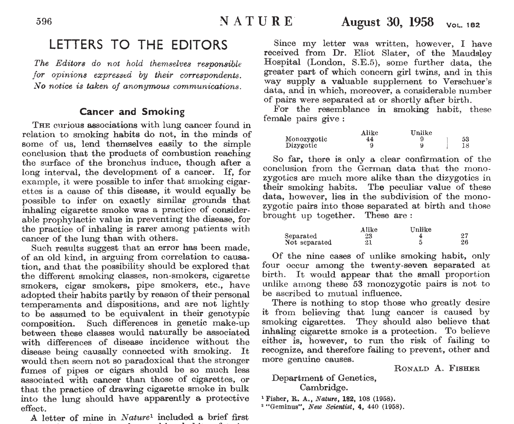

```{r setup, include=FALSE}
knitr::opts_chunk$set(echo = TRUE, fig.retina = 3)
library(ggplot2)
library(mosaic)
library(dplyr)
```

```{r strat-samp, echo = FALSE}
teams <- c(rep("New York Yankees", 40), 
           rep("San Diego Padres", 40), 
           rep("Seattle Mariners", 40), 
           rep("Los Angeles Dodgers", 40))
salary <- c(rnorm(40, mean = 25), 
            rnorm(40, 16), 
            rnorm(40, 23), 
            rnorm(40, 15))
df <- data.frame(teams, salary)
```

---
# Review: Sampling Strategies

```{r comp, echo=FALSE, fig.align='center', fig.width=9, fig.height = 5, message=FALSE}
library(mosaic)
SRS <- do(1000) * mean(~salary, data = sample(df, 40))
STR <- do(1000) * mean(~salary, data = rbind(sample(subset(df, teams == "New York Yankees"), 10),
                                             sample(subset(df, teams == "San Diego Padres"), 10),
                                             sample(subset(df, teams == "Seattle Mariners"), 10),
                                             sample(subset(df, teams == "Los Angeles Dodgers"), 10)))
sim <- data.frame(salary = rbind(SRS, STR), method = rep(c("SRS", "STR"), each = 1000))
ggplot(sim, aes(x = mean, fill = method)) +
  geom_density(alpha = .7) +
  annotate("segment", x = mean(df$salary), xend = mean(df$salary),
           y = 0, yend = 3, color = "black", linetype = 2) +
  theme_bw()
```

---
# Sampling Strategies

--

**SRS**: Unbiased, easy, but can be high variance.

--

**Stratified Sampling**: Divide population into strata that are *similar* within and *different* between. Draw SRS from within each strata.


---
# Experimental Design

---

```{r out.width=800, echo = FALSE, fig.align='center'}

```

---

```{r out.width=800, echo = FALSE, fig.align='center'}
knitr::include_graphics("figs/corrs1.png")
```


---

```{r out.width=800, echo = FALSE, fig.align='center'}
knitr::include_graphics("figs/corrs2.png")
```


---
# If you learn one thing in this class...

```{r out.width=800, echo = FALSE, fig.align='center'}
knitr::include_graphics("figs/xkcd-correlation.png")
```


---
# Principles of Experimental Design

--

**Control**: Compare treatment of interest to a control group.

--

**Randomization**: Randomly assign subjects to treatments.

--

**Replication**: Within a study, replicate by collecting a sufficiently large sample. Or replicate the entire study.

--

**Blocking**: If there are variables that are known or suspected to affect the response variable, first group subjects into blocks based on these variables, and then randomize cases within each block to treatment groups.

---
# Replication

```{r out.width=800, echo = FALSE, fig.align='center'}
knitr::include_graphics("figs/psych.png")
```

---
# Blocking

A study is designed to test the effect of light level and noise level on exam performance of students. The researcher also believes that light and noise levels might have different effects on males and females, so wants to make sure both genders are represented equally under different conditions. Which of the below is correct?

1. There are 3 explanatory variables (light, noise, gender) and 1 response variable (exam performance)
2. There are 2 explanatory vars (light and noise), 1 blocking var (gender), and 1 response var (exam performance)
3. There is 1 explanatory var (gender) and 3 response vars (light, noise, exam performance)
4. There are 2 blocking vars (light and noise), 1 explanatory var (gender), and 1 response var (exam performance)


---
# Other key ideas

--

**Placebo**: fake treatment, often used as the control group for medical studies

--

**Placebo effect**: experimental units showing improvement simply because they believe they are receiving a special treatment

--

**Blinding**: when experimental units do not know whether they are in the control or treatment group

--

**Double-blind**: when both the experimental units and the researchers do not know who is in the control and who is in the treatment group


---
# Consider acupuncture

```{r out.width=500, echo = FALSE, fig.align='center'}
knitr::include_graphics("figs/acupuncture.png")
```

How do you test if acupuncture reduces pain?

--

"Sham acupuncture" is a good control.


---
# Practice

1. Find a partner nearby and introduce yourself.
2. Discuss the problems on the handout and record your thoughts.

