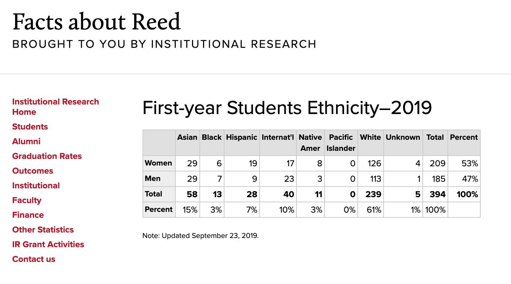
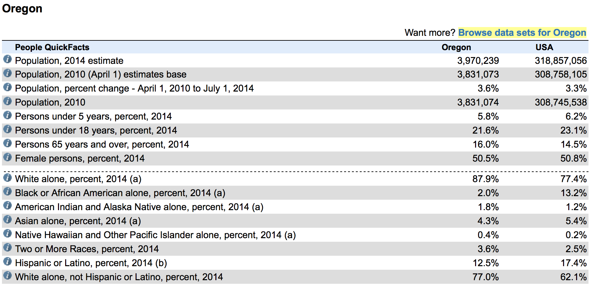
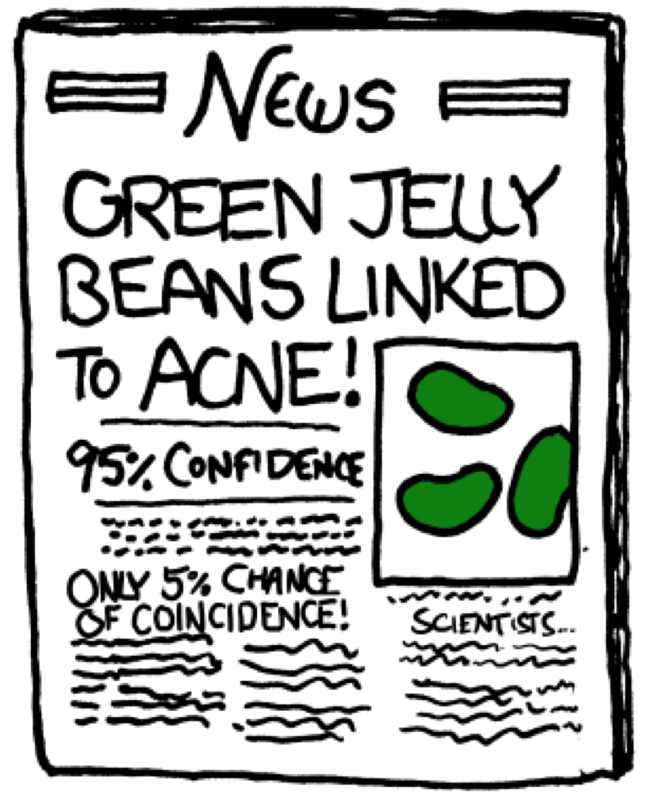
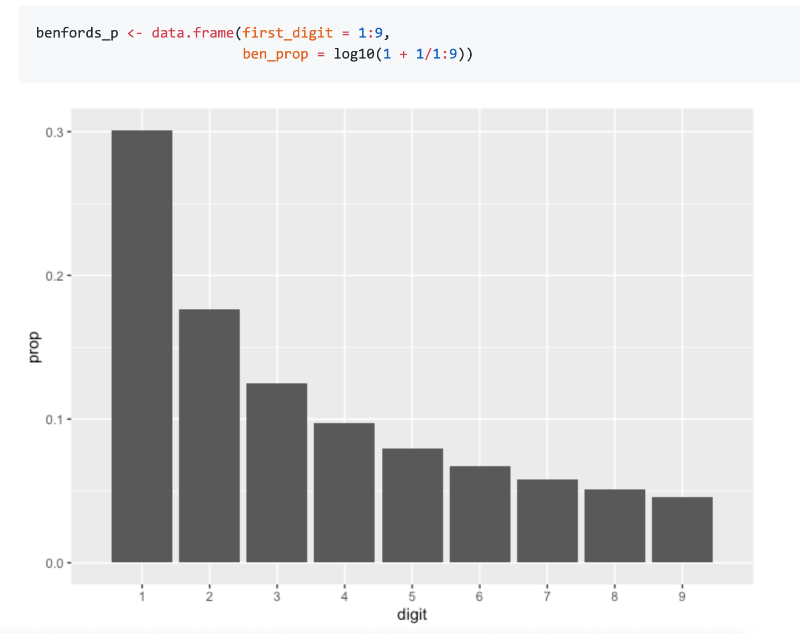
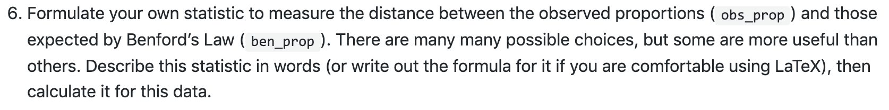
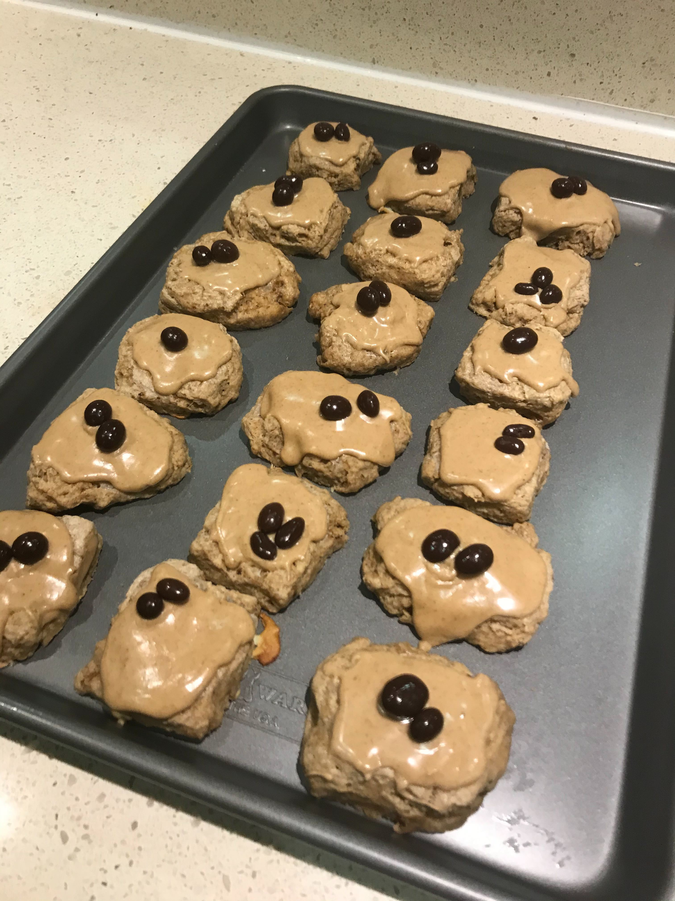

```{r include = FALSE}
knitr::opts_chunk$set()
library(tidyverse)
library(infer)
set.seed(314)
```

## Ex: Diversity at Reed

```{r out.width=550, echo = FALSE, fig.align='center'}

```

In terms of ethnic diversity, how does the first year student body compare
to the general population of Oregon?

---

```{r out.width=700, echo = FALSE, fig.align='center'}

```

---

```{r out.width=700, echo = FALSE, fig.align='center'}

```


---
# The data

Ethnicity | Asian | Black | Hispanic | White | Other | Total
----------|-------|-------|----------|-------|-------|-------
Reed count|  58   |   13  |   28     |  239  |  51   |  394
Oregon %  |  .043 |  .02  |   .125   |  .77  | .042  |   1


If the students at Reed were drawn from a population with these proportions,
how many *counts* would we expect in each group?

--

$$\textrm{exp. count} = n \times p_i$$

---
# The data

Ethnicity   | Asian | Black | Hispanic | White | Other | Total
------------|-------|-------|----------|-------|-------|-------
Obs. count |  58   |   13  |   28     |  239  |  51   |  394
Exp. count | 16.94 |  7.88 | 49.25  | 303.38 | 16.548 | 394


- Some sampling variability is expected, but how far from expected is too far?


---
# Simulating Oregonian Reedies
--

.tiny[
```{r sim}
n <- 354
p <- c(.043, .02, .125, .77, .042)
samp <- sample(c("asian", "black", "hispanic", "white", "other"), 
               size = n, 
               replace = TRUE, 
               prob = p) %>%
  factor(levels = c("asian", "black", "hispanic", "white", "other"))
table(samp)
```
]

--

.tiny[
```{r}
obs <- c(58, 13, 28, 239, 51)
```
]

---
# Simulating Oregonian Reedies, again
--

.tiny[
```{r sim2}
samp <- sample(c("asian", "black", "hispanic", "white", "other"), 
               size = n, 
               replace = TRUE, 
               prob = p) %>%
  factor(levels = c("asian", "black", "hispanic", "white", "other"))
table(samp)
obs <- c(58, 13, 28, 239, 51)
```
]

---
# Simulating Oregonian Reedies, again again
--

.tiny[
```{r sim3}
samp <- sample(c("asian", "black", "hispanic", "white", "other"), 
               size = n, 
               replace = TRUE, 
               prob = p) %>%
  factor(levels = c("asian", "black", "hispanic", "white", "other"))
table(samp)
obs <- c(58, 13, 28, 239, 51)
```
]


---
# Simulating Oregonian Reedies

```{r echo = FALSE}
library(infer)
reed_demos <- data.frame(ethnicity = rep(c("asian", "black", "hispanic", "white", "other"),
                                         times = c(49, 10, 34, 206, 55)))
```

.tiny[
```{r infer-sim, eval = FALSE}
sim_reedies <- reed_demos %>%
  specify(response = ethnicity) %>%
  hypothesize(null = "point", p = c("asian"    = .043, 
                                    "black"    = .02, 
                                    "hispanic" = .125, 
                                    "white"    = .77, 
                                    "other"    = .042)) %>%
  generate(reps = 12, type = "simulate")
sim_reedies
```
]

--

.tiny[
```{r ref.label = "infer-sim", echo = FALSE}
sim_reedies <- reed_demos %>%
  specify(response = ethnicity) %>%
  hypothesize(null = "point", p = c("asian"    = .043, 
                                    "black"    = .02, 
                                    "hispanic" = .125, 
                                    "white"    = .77, 
                                    "other"    = .042)) %>%
  generate(reps = 12, type = "simulate")
sim_reedies
```
]


---
# Visualizing our Simulated Oregonian Reedies
--

```{r eval = FALSE}
sim_reedies %>%
  ggplot(aes(x = ethnicity)) +
  geom_bar() +
  facet_wrap(vars(replicate))
```


---
# Visualizing our Simulated Oregonian Reedies

```{r echo = FALSE, fig.align="center", fig.height=4.7}
sim_reedies %>%
  ggplot(aes(x = ethnicity)) +
  geom_bar() +
  facet_wrap(vars(replicate))
```


---
# Visualizing our Simulated Oregonian Reedies

```{r eval = FALSE}
sim_reedies %>%
  ggplot(aes(x = ethnicity)) +
  geom_bar() +
  facet_wrap(vars(replicate)) + coord_flip() #<<
```

---
# Simulated vs Observed

```{r echo = FALSE, fig.align="center", fig.height=4.7}
sim_reedies %>%
  ggplot(aes(x = ethnicity)) +
  geom_bar() +
  facet_wrap(vars(replicate)) + coord_flip()
```

--

```{r echo = FALSE, fig.align="center", fig.height = 1.8, fig.width = 2.5}
reed_demos %>%
  ggplot(aes(x = ethnicity)) +
  geom_bar() +
  coord_flip()
```


---
# Inference on many ps

We *could* do a tests/CIs on $p_{reed} - p_{oregon}$ for each group, however:

- We have the whole population of Oregon.
- Beware of multiple comparisons!

--

```{r out.width=200, echo = FALSE, fig.align='center'}

```

---

```{r out.width=200, echo = FALSE, fig.align='center'}
knitr::include_graphics("figs/significant.png")
```


---
# Sound familiar? Benford's Law!
--

```{r out.width=550, echo = FALSE, fig.align='center'}

```

--

```{r out.width=550, echo = FALSE, fig.align='center'}

```

---
# Creating a statistic

---
# Creating a statistic

For each of $k$ categories:

1. Calculate the difference between observed and expected counts.

2. Scale each difference by an estimate of the SE ( $\sqrt(exp)$ ).

3. Square the scaled difference to get rid of negatives.


Then add them all up.

$$\chi^2 = \sum_{i = 1}^k \frac{(obs - exp)^2}{exp}$$

---
# Reed Data

Ethnicity   | Asian | Black | Hispanic | White | Other | Total
------------|-------|-------|----------|-------|-------|-------
Obs. count  |  49   |   10  |   34     |  206  |  55   |  354
Exp. count | 15.22 |  7.08 | 44.25 | 272.58 | 14.87 | 354

--

\begin{array}
Z_{asian}^2 = (49 - 15.22)^2/15.22 = 74.97 \\
Z_{black}^2 = (10 - 7.08)^2/7.08 = 1.20 \\
Z_{hispanic}^2 = (34 - 51.5)^2/51.5 = 5.95 \\
Z_{white}^2 = (206 - 272.58)^2/272.58 = 16.26 \\
Z_{other}^2 = (55 - 14.87)^2/14.87 = 108.30
\end{array}

--

\begin{array}
Z_{asian}^2 + Z_{black}^2 + Z_{hispanic}^2 + Z_{white}^2 + Z_{other}^2 = 206.68 = \chi^2_{obs}
\end{array}

---
# Simulating $\chi^2$ under $H_0$
--

.tiny[
```{r nullchi, eval = FALSE}
(null <- reed_demos %>%
  specify(response = ethnicity) %>%
  hypothesize(null = "point", p = c("asian"    = .043, 
                                    "black"    = .02, 
                                    "hispanic" = .125, 
                                    "white"    = .77, 
                                    "other"    = .042)) %>%
  generate(reps = 500, type = "simulate") %>%
  calculate(stat = "Chisq"))
```
]

--

.tiny[
```{r ref.label = "nullchi", echo = FALSE}
null <- reed_demos %>%
  specify(response = ethnicity) %>%
  hypothesize(null = "point", p = c("asian"    = .043, 
                                    "black"    = .02, 
                                    "hispanic" = .125, 
                                    "white"    = .77, 
                                    "other"    = .042)) %>%
  generate(reps = 500, type = "simulate") %>%
  calculate(stat = "Chisq")
null
```
]

---
# The null distribution
--

```{r, echo=FALSE, fig.height=3.5, fig.align="center"}
visualize(null) +
  shade_pvalue(obs_stat = 206.68, direction = "greater")
```

What is the probability of observing our data or more extreme ( $\chi^2 = 206.68$) under
the null hypothesis that Reedies share the same ethnicity proportions as Oregon?

--

About zero.

---
# An alternate path to the null
--

If...

--

1. Independent observations
--

2. Each cell count has a count $\ge$ 5
--

3. $k \ge 3$

--

then our statistic can be well-approximated by the $\chi^2$ distribution with $k - 1$ degrees of freedom.

---
# The null distribution
--

```{r, echo = FALSE, fig.height=3.5, fig.align = "center", warning = FALSE}
null %>%
  visualize(method = "both")
```

--

```{r}
1 - pchisq(206.68, df = 4)
```


---
# Postscript: Great Reed Bake-off 2020
--

```{r out.width=400, echo = FALSE, fig.align='center'}

```